# Raw Database
SELECT *
FROM layoffs;

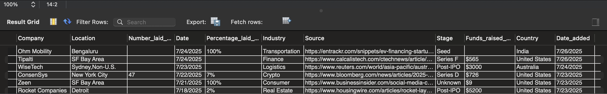

# Processed Database
SELECT *
FROM layoffs_staging2;

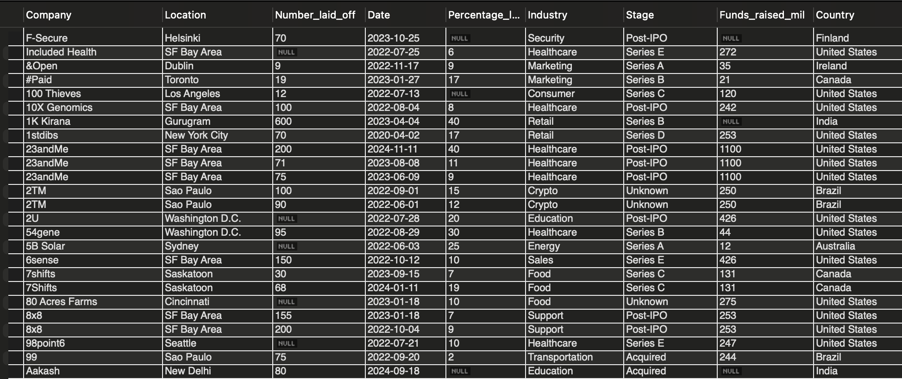

# 1. Which was the most lay-offs in one go, and which company did so?
SELECT *
FROM layoffs_staging2
WHERE Number_laid_off = (
SELECT MAX(Number_laid_off)
FROM layoffs_staging2
);

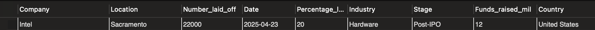

# 2. How many companies went out of business since 2020?
SELECT COUNT(*)
FROM layoffs_staging2
WHERE Percentage_laid_off = 100;

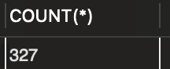

# 3. Which companies have had the most lay offs since 2020?
SELECT Company, SUM(Number_laid_off)
FROM layoffs_staging2
GROUP BY Company
ORDER BY 2 DESC;

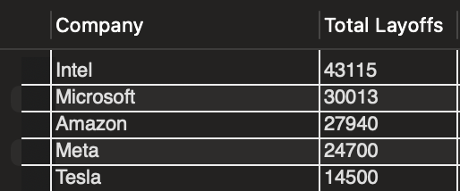

# 4. What industry got hit the worst in this 5 year period?
SELECT Industry, SUM(Number_laid_off)
FROM layoffs_staging2
GROUP BY Industry
ORDER BY 2 DESC;

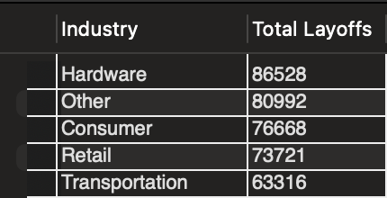

SELECT Industry, SUM(Number_laid_off)
FROM layoffs_staging2
GROUP BY Industry
ORDER BY 2;

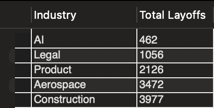

# 5. Which countries were hit the worst during this period?
SELECT Country, SUM(Number_laid_off)
FROM layoffs_staging2
GROUP BY Country
ORDER BY 2 DESC;

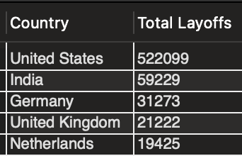

# 6. Which year was hit the worst since 2020?
SELECT YEAR(`Date`) AS `Year`, SUM(Number_laid_off)
FROM layoffs_staging2
GROUP BY YEAR(`Date`)
ORDER BY 1;

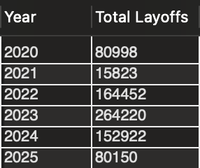

# 7. What stage companies were hit the most?
SELECT Stage, SUM(Number_laid_off)
FROM layoffs_staging2
GROUP BY Stage
ORDER BY 2 DESC;

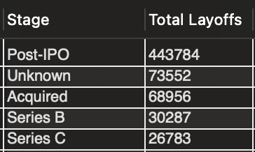

# 8. Progression of Layoffs
WITH Rolling_Total AS
(
SELECT SUBSTRING(`Date`,1,7) AS `MONTH`, SUM(Number_laid_off) AS `Total laid off`
FROM layoffs_staging2
GROUP BY `MONTH`
ORDER BY 1 ASC
)
SELECT `MONTH`, `Total laid off`,
SUM(`Total laid off`) OVER(ORDER BY `MONTH`) AS `Rolling total`
FROM Rolling_Total;

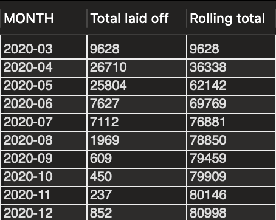

# 9. What were the top 5 companies laying off the most each year?
WITH Company_Year (Company, `Year`, `Total laid off`) AS
(
SELECT Company, YEAR(`Date`), SUM(`Number_laid_off`)
FROM layoffs_staging2
GROUP BY Company, YEAR(`Date`)
ORDER BY 3 DESC
), Company_Year_Rank AS
(
SELECT *, DENSE_RANK() OVER (PARTITION BY `Year`
ORDER BY `Total laid off` DESC) AS `Rank by year`
FROM Company_Year
)
SELECT DISTINCT *
FROM Company_Year_Rank
WHERE `Rank by year` <=5;

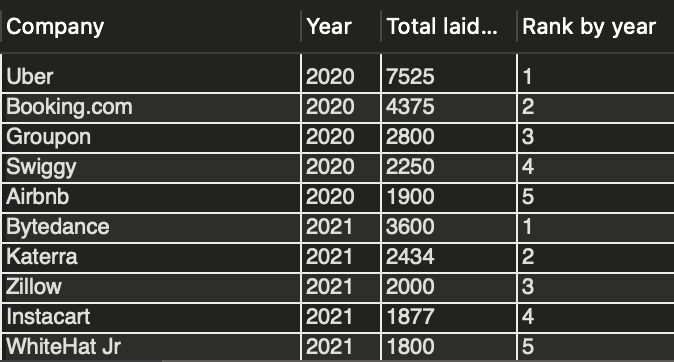
