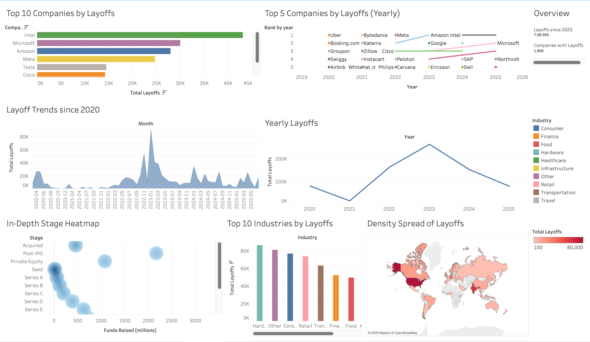
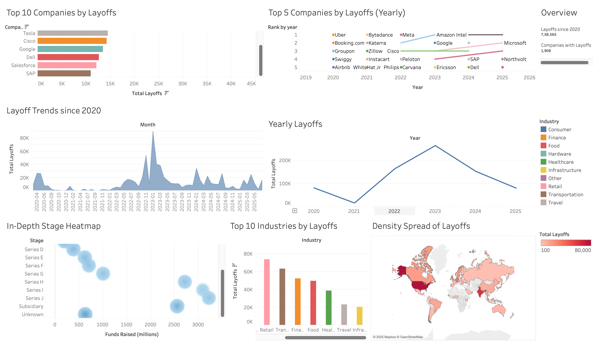

# Global Layoffs Analysis Dashboard

This repository contains a Tableau dashboard that provides a comprehensive analysis of global layoffs since 2020. The interactive dashboard visualizes trends, top affected companies and industries, geographical distribution, and other key metrics related to the recent wave of job cuts.

## Dashboard Preview

## Key Visualizations & Insights

This dashboard is organized into several key sections, each providing a unique perspective on the layoff data:

*   **Overview & KPIs:**
    *   **Total Layoffs:** A summary card showing the cumulative number of layoffs recorded since 2020.
    *   **Companies with Layoffs:** A count of the total number of companies that have conducted layoffs.

*   **Company & Industry Analysis:**
    *   **Top 10 Companies by Layoffs:** A horizontal bar chart ranking the companies with the highest number of total layoffs.
    *   **Top 5 Companies by Layoffs (Yearly):** A timeline chart that tracks the layoff events for the top 5 most-affected companies each year, showing how leaders in layoffs change over time.
    *   **Top 10 Industries by Layoffs:** A vertical bar chart highlighting the industries most impacted by job cuts.

*   **Trend Analysis:**
    *   **Layoff Trends Since 2020:** An area chart illustrating the volume of layoffs per month, making it easy to spot peaks and trends over time.
    *   **Yearly Layoffs:** A line chart that provides a high-level view of the total layoffs for each year.

*   **In-Depth & Geographical Analysis:**
    *   **In-Depth Stage Heatmap:** A scatter plot that correlates the funding stage of a company (e.g., Seed, Series A, Post-IPO) with the funds it has raised, helping to identify patterns between company maturity and layoff events.
    *   **Density Spread of Layoffs:** A geographic heatmap of the world, showing the concentration of layoffs by country and region.

## How to Use

1.  **Download:** To explore the dashboard interactively, download the `.twbx` file from this repository.
2.  **Open:** Use Tableau Desktop or the free Tableau Reader to open the `.twbx` file.
3.  **Interact:** All charts are interactive. You can click on different elements to filter the data across the entire dashboard.

This analysis is based on a comprehensive dataset of global layoffs. The raw data used for this project can be found in the `Tableau_datasets` folder.

## Tools Used

*   **Tableau:** Used for data visualization and building the interactive dashboard.
