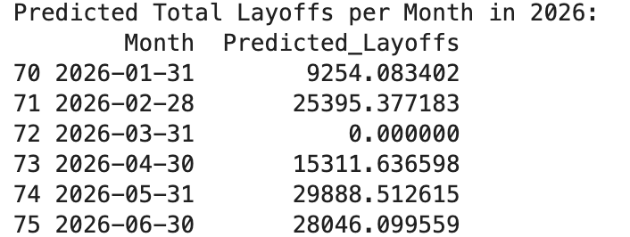
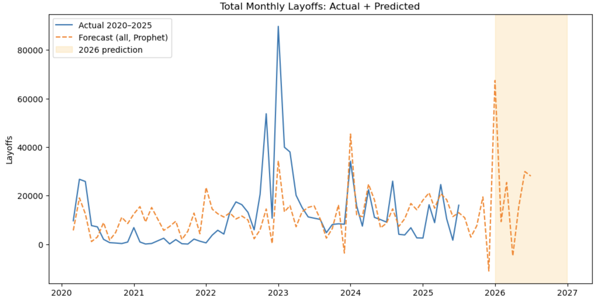
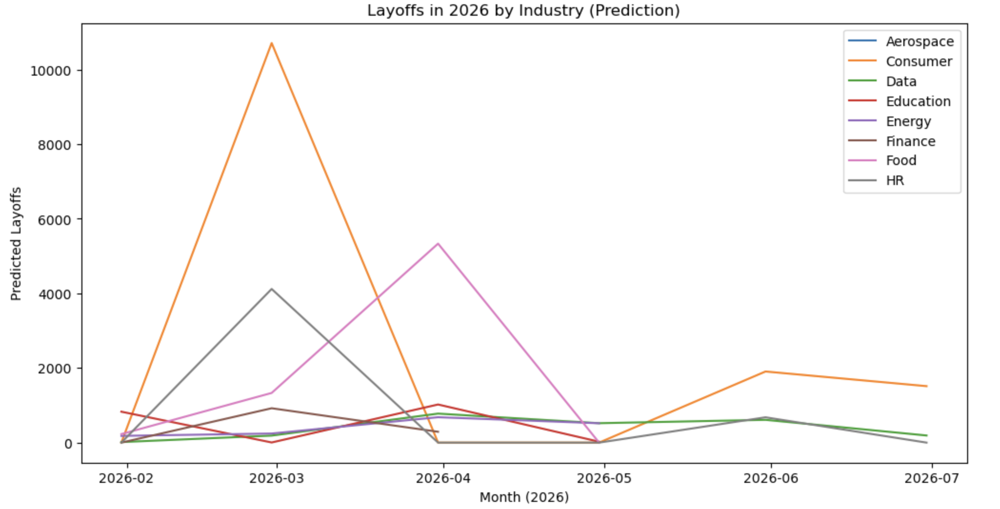
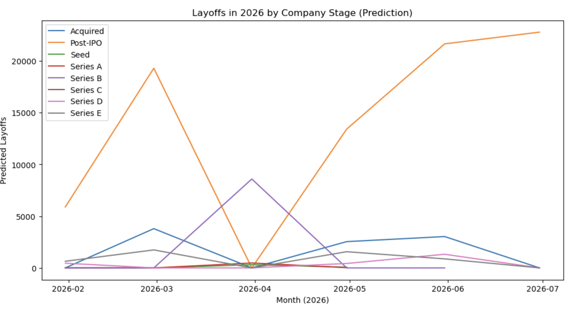
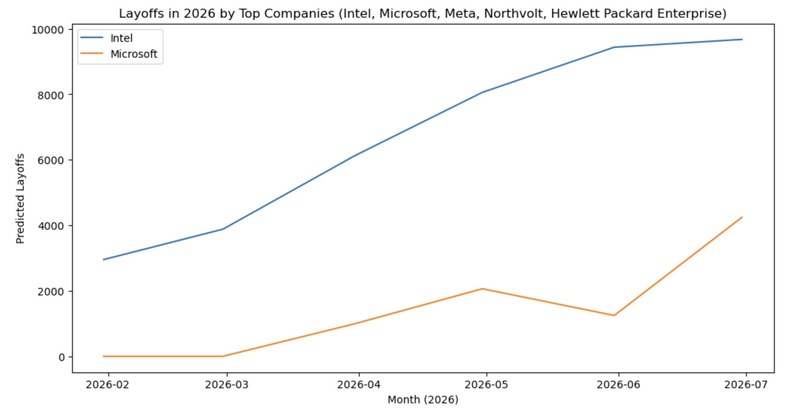

# Python Scripts and Notebooks

This directory contains the core Python logic for the Global Layoffs project. It includes Jupyter Notebooks for scraping the data from the web and for building the predictive time-series models using Prophet.

## Files

*   **`Layoffsfyi-Data-Pull.ipynb`**: This notebook handles the automated data scraping process. It uses Selenium to create a headless browser and navigate to `layoffs.fyi`, scrolls to load the entire data table, and then intelligently appends only *new* layoff entries to the MySQL database.
*   **`Layoffs-Prediction-Model-2026.ipynb`**: This notebook contains the machine learning component of the project. It uses the Prophet library to build forecasting models to predict layoff trends for 2026.

DISCLAIMER: THE PROPHET MODEL IS CURRENTLY UNDER MORE REFINEMENT TO FIX BUGS. THIS WILL BE UPDATED AND COMMITTED TO THE REPO SOON.

## How to Use

### 1. Data Scraping (`Layoffsfyi-Data-Pull.ipynb`)

This notebook is designed to be a "set it and forget it" scraper that keeps your database updated.

**Key Features:**
*   **Dynamic Scraping**: Uses Selenium to handle a dynamically loaded web table.
*   **Change Detection**: Before scraping, it generates an MD5 hash of the table's content. It only proceeds with scraping and database operations if this hash has changed since the last run, making it highly efficient.
*   **Incremental Updates**: It compares the scraped data with existing records in the MySQL database and only appends new, unique rows.
*   **Automation**: The main loop runs continuously, checking for updates every 10 minutes.

**Instructions:**
1.  Make sure all packages from the root `requirements.txt` file are installed (`pip install -r requirements.txt`).
2.  Update the SQLAlchemy database connection string in the notebook to point to your `Global_Layoffs` MySQL database.
3.  Run the cells in the notebook. The scraping process will begin and continue until you manually interrupt the kernel.

### 2. Prediction Modeling (`Layoffs-Prediction-Model-2026.ipynb`)

This notebook takes the cleaned data from the database and uses it to forecast future trends.

**Key Features:**
*   **Prophet for Forecasting**: Leverages Facebook's Prophet library, which is apt for time-series data with seasonal trends.
*   **Segmented Analysis**: It doesn't just predict the total number of layoffs, but also builds separate models to forecast trends by:
    *   **Industry**
    *   **Company Stage**
    *   **Top 5 Companies** (based on the most recent year's data)
*   **Data Visualization**: Generates plots using `matplotlib` to visualize the actual historical data alongside the forecasted trends.
*   **Data Export**: Includes commented-out code to save the final predictions to CSV files, which can then be used in Tableau.

**Instructions:**
1.  Ensure the data has been scraped and cleaned in the MySQL database (The additional two tables rolling_total and companies_rank_by_year queried from MYSQL are ESSENTIAL for this model's training.)
2.  Update the database connection details (`pymysql.connect(...)`) to access the data.
3.  Run the cells sequentially to perform data loading, modeling, and visualization.
4.  Uncomment the final cells if you wish to export the prediction dataframes to CSV files.

## Example Outputs (For Prophet)
The Prediction Model notebook generates plots showing layoff trends for 2026 by company, stage, industry, and a time series.

